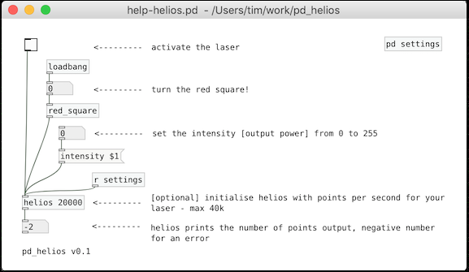

# pd_helios
Pure data external for the Helios Laser DAC

* https://github.com/Grix/helios_dac
* https://github.com/pure-data/pure-data


========================

**NOTE: This project is a fork of [pd_helios](https://github.com/timredfern/pd_helios), that provides some extra functionality over the original:**
- Access to more DAC features: start immediately, don't block, single mode etc.
- Frame dump - sets a trigger which causes the next frame sent to the DAC to be dumped to the Pd console.
- Adjustable polling limit so that infinite loops are not possible.
- Transforms - scale, rotate, translate, flip.
- Color - TTL threshold, color timing offset, channel mapping.
- Raw mode - disables the builtin points optimization - for when you want to manage subdivision, dwell points etc yourself.
- Geometric correction - scale X Y, shear, keystone, linearity, bow, pincushion

You can use [helios-control](https://github.com/julesb/helios-control) to adjust all of the above from within Pd.


========================




## Version

0.1

note - it's not presently possible to have more than 1 helios object open. 

## Use

pd_helios currently builds on MacOS, tested on Mojave (OSX v10.14). It builds on Ubuntu 16.04 x64 but I haven't got it to work - using a VM, don't know if this is the issue. It should work on Microsoft Windows with the appropriate libusb library.

## To build

Clone this repo and the source code to pure data

```
git clone git@github.com:timredfern/pd_helios.git
git clone https://github.com/pure-data/pure-data
cd pd_helios
make PDINCLUDEDIR=../pure-data/src/
```		

(or wherever you cloned pure data)

To test the example patch:

```
pd help-helios.pd
```

(from wherever you have installed Pd. For the Purr-data distribution of Pd, I used this:)

```
/Applications/Pd-l2ork.app/Contents/MacOS/nwjs help-helios.pd 
```

## Problems with old versions of MacOS (specifically EL Capitan)

Install libusb from Homebrew

First follow these instructions: https://brew.sh/

Then:

```
brew install libusb

```

## Copyright

Except as otherwise noted, all files in the this distribution are

#### Copyright © 2019 Tim Redfern

For information on usage and redistribution, and for a DISCLAIMER OF ALL
WARRANTIES, see LICENSE included in this distribution.
(Note that Helios SDK and libusb are copyrighted separately).

## NOTE

Lasers are dangerous. Improper use of this software can damage your laser, or yourself. This software comes with NO WARRANTY, see above.

## Acknowledgements

Thanks to NULL + VOID
